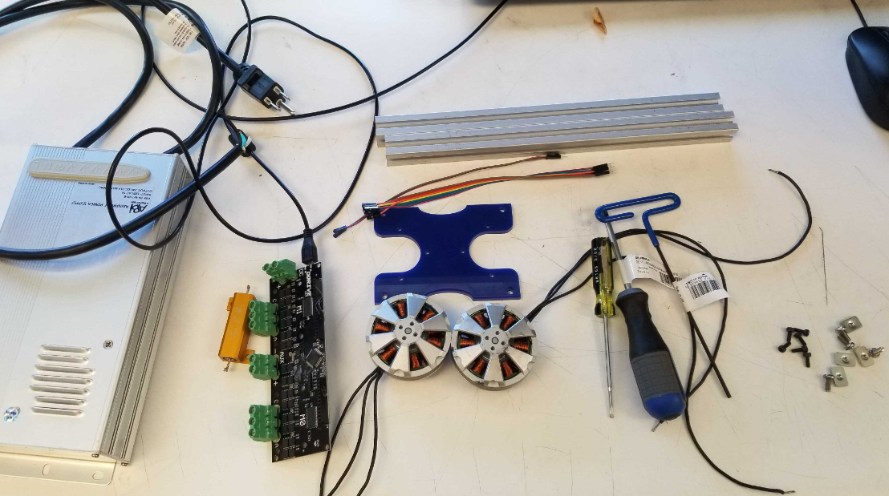
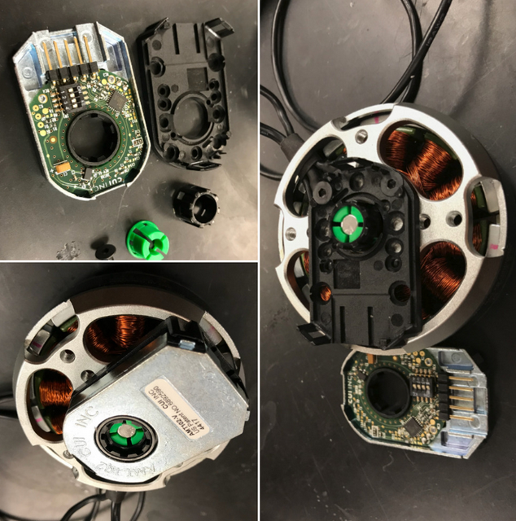
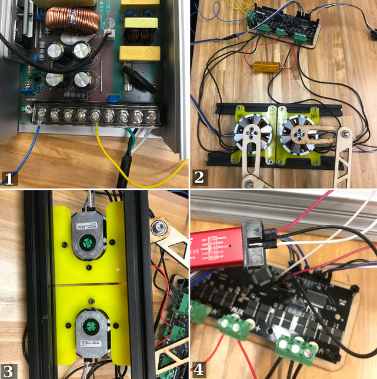
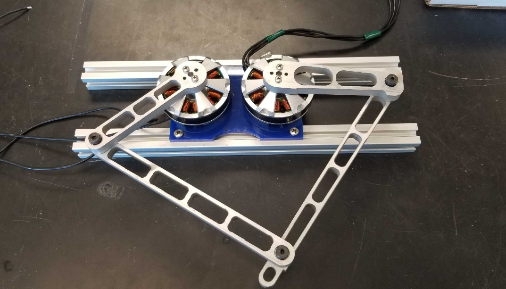

# Overview

For the first half of the class student teams will be working with a single leg kit. This consists of two motors and encoders, leg components, and a motor driver with power supply. The following instructions will lead you through the assembly and setup of your leg kit. 

__Disclaimer: While we are using low-voltages (24V) it is still important to follow safe laboratory practices. Always work with your partner in the lab and each power supply must be connected to the provided surge protector with on/off switch.__ 

# Assembly instructions

Follow all instructions carefully! The general order of operations should be: 

1) Hardware assembly, including: encoder mounted onto the motors, motors secured onto the 8020 aluminums, and wire connections of motors and encoders with the ODrive (board needs to be powered with 24V PS). 
2) Configuring your programming environment (using Python 3) following the 'Getting Started' [rules](https://docs.odriverobotics.com/).

3) Testing the ODrive through ```explore_odrive.py```. 

4) Connect the legs.




## Item list per group (2-3 ppl): 
1. BLDC motors 335KV x2 

2. Waterjet aluminum legs (distributed later) 

3. 21A~24V DC power supply x1

4. AMT 102 CUI encoder x2 (already mounted onto the motors)

5. ODrive (motor control board) x1

6. M4 bolts and drop in nuts (for 8020 T-slots) x4

7. Jumper wires  x8

8. 8020 T-slot aluminum extrusions x2

9. allen wrench for M3 socket screws x1

10. flat head screw driver x1

11. 15ft power coord (will be chopped into three pieces for the power supply and motor cables)

12. Phillips head screw driver x1


## Mechanical setup (phase 1)

1. Mounting encoders (already done for you!)



2. Fasten the motor on to the acrylic mounts then fasten the whole thing onto the 8020s, adjust the distance of the 2 motors as you want. 


## Electrical connections:

1. The power supply is connected to the wall using the provided 3-wire cord. Cut the 3-wire coord (__while unplugged!__) approximately 2 feet from the plug end. Strip the wires and connect the color codes to the power supply terminals (see the table below). Use two 12 gauge wires to connect the power supply to the ODrive. 

_Note_: (on the power supply)  

| Power supply terminal | Connected to |
|-----------|:--------|
| G (the ground symbol) | Green wire | 
| N | Black wire | 
| L | White wire | 
| +V | +V (ODrive) |
| -V | -V (ODrive) |
                                 

2. Motors (3 wires on each) connected to both M0 and M1 port. There are three wires coming out of the motor, the middle wire __MUST__ be connected to the middle terminal on the ODriver but the 1st and 3rd wires can be connected to either ODrive end (this will only affect the default rotating direction of the motor).

3. Encoder must to be connected correctly using 4 jumper wires, __or the encoder will be burned!!__
  
  | Encoder   | ODrive   |
  |-----------|:--------|
  | GND       | GND|
  | 5V        | 5V|
  | Channel A |  A|
  | Channel B | B|
  
4. Programmer connection is quite the same as the encoder, __GND has to be connected first!!__ [Ctrl+F --> "SWC" on this page](https://github.com/madcowswe/ODrive/blob/master/Firmware/README.md)
  
  | Programmer  | ODrive   |
  |-----------|:--------|
  | GND       | GND|
  | SWCLK        | SWC|
  | SWDIO |   SWD|
  
  
5. Solder two lead wires to the shunt resistor and attach it to the ODrive board (__AUX__)




The Electrical connections should look like the image above. In (1) we show the power supply connections (__make sure to replace the cover and the plastic terminal covers before using!__). In (2) we show the motor & encoder connections to the ODrive and the power resistor. (3) Shows the encoders. (4) Shows the location of the programmer connections. 

Now we finished all the electronic connection parts  (o_o)!

## Software configuration:

1. Download Python 3 and Jupyter Lab as mentioned in class. (__Windows 10/8/7 can use Anaconda-miniconda, install python and jupyter lab from there__) [Anaconda](https://www.anaconda.com/download/). After finishing the installations, we can simply launch the __jupyter lab__ in the anaconda navigator). Anaconda Prompt is also useful in installing all useful python software and packages. 

2. Download VSCode for firmware flashing [VSCode](https://code.visualstudio.com/). This will be used to program the ODrive firmware.

3. Download the whole zip folder on the website and follow the steps in setting up the firmware [ODrive github firmware](https://github.com/madcowswe/ODrive/blob/master/Firmware/README.md)

4. For Windows/Mac/Linux users, simply following the instructions on the ODrive [website](https://docs.odriverobotics.com/). For any questions considering the firmware setups please e-mail TA for help <mij032@ucsd.edu>

## Testing communication and control of the motors without the legs

1. Following the [instructions](https://github.com/madcowswe/ODrive/blob/master/Firmware/README.md) on the ODrive website setup the firmware. 

    a. Change the motor poles to 7.
    
    b. Verify the encoder CPR is 2048*4.
    
    c. Connect the programmer and build and flash the firmware.

2. Open up a terminal and navigate to the folder with the ```explore_odrive.py``` file. 

3. Run the command ```python explore_odrive.py``` which drops you in an interactive shell. 

4. Try and test the encoder. Run the command ``` print(my_drive.motor0.encoder.pll_pos,my_drive.motor0.encoder.pll_pos)```. (rotate the motor shaft and run this command again and you'll see the change.)

5. Lastly move the motor a short distance. Run the command ``` my_drive.motor0.set_pos_setpoint (a1,a2,a3)```. (a1--position setpoint, a2--feedforward velocity, a3--feedforward current). The same with motor1 ``` my_drive.motor1.set_pos_setpoint (a1,a2,a3)```

## Attach legs

3.Secure the legs directly onto the motors using long M3 bolts, run the example code as provided from the ODrive folder you downloaded. 

Using the legs as a manipulator to draw your name! (a pen should be inserted)





```python

```
