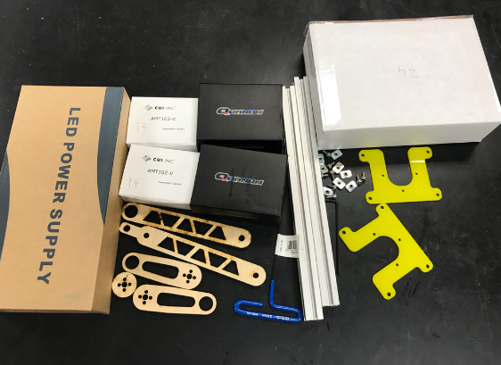
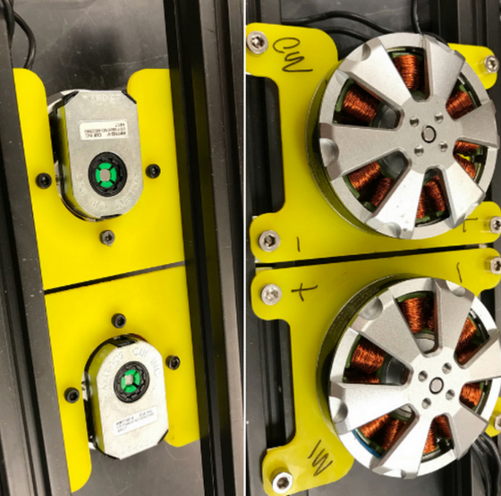
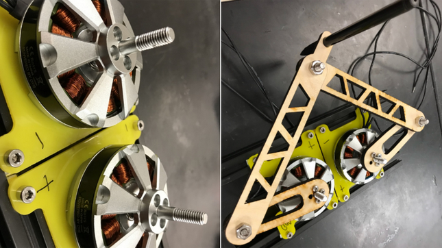

# Overview

For the first half of the class student teams will be working with a single leg kit. This consistes of two motors and encoders, leg components, and a motor driver with power supply. The following instructions will lead you through the assembly and setup of your leg kit. 

__Disclaimer: While we are using low-voltages (24V) it is still important to follow safe laboratory practices. Always work with your partner in the lab and each power supply must be connected to the provided surge protector with on/off switch.__ 

# Before we start




## Item list (each group): 
1.BLDC motors 335KV x2 (with M3x10mm bolts x8)

2.Laser cut legs and spacers x5

3.21A~24V DC power supply x1

4.AMT 102 CUI encoder x2 (with 4 flat head M3 bolts)

5.ODrive x1

6.M4 bolts x8 and nuts x8

7.jumping wires  (>=11)

8.8020s (T-slots aluminum frame) x2

9.allen wrench M2.5 x1

10.allen wrench M3 x1


     


## Eletronic connections:

1.Power supply connected to the wall using 3-wire cord, with thin stripped wires powering the ODrive board. 

_Note_: (on the power supply)  
     * G-green
     * N-black
     * L-white
     * +V <--> +V (ODrive)
     * -V <--> -V (ODrive) 
                                 


2.Motors (3 wires on each) connected to both M0 and M1 port (__does not matter what sequence they are, as long as they are connected, but that will affect the motor default rotary direction__.)

3.Encoder must to be connected correctly using 4 jumper wires, __or the encoder will be burned!!__
  
  | Encoder   | ODrive   |
  |-----------|:--------|
  | GND       | GND|
  | 5V        | 5V|
  | Channel A |  A|
  | Channel B | B|
  
4.Programmer connection is quite the same as the encoder, __GND has to be connected first!!__ [Ctrl+F --> "SWC" on this page](https://github.com/madcowswe/ODrive/blob/master/Firmware/README.md)
  
  | Programmer  | ODrive   |
  |-----------|:--------|
  | GND       | GND|
  | SWCLK        | SWC|
  | SWDIO |   SWD|
  
5.Solder the shunt resistance onto the ODrive board (__AUX__)
  
  
  
  


Here we finished all the electronic connection parts  (o_o)!

## Software configuration:


1.Download Python 3 and Jupyter Lab as mentioned in class. (__Windows 10/8/7 can use Anaconda, install python and jupyter lab from there__) [Anaconda Downloads](https://www.anaconda.com/download/#linux)

2.Download VSCode for firmware flashing [VSCode](https://code.visualstudio.com/)

3.Download the whole zip folder on the website and follow the steps in setting up the firmware [ODrive github firmware](https://github.com/madcowswe/ODrive/blob/master/Firmware/README.md)


## Mechanical setup


1.Encoder connection: using 2 M3 bolts to connect the encoder on the back of the shaft of the DC motor.


2.Fasten the motor on to the acrylic mounts then fasten the whole thing onto the 8020s, adjust the distance of the 2 motors as you want. 





3.Put on the legs onto the motors using props(in the motor box), bolts and nuts (1/4''-20) and run the example code as provided from the ODrive folder you downloaded. 

Using the legs as a manipulator to draw your name (a pen should be inserted)





```python

```
