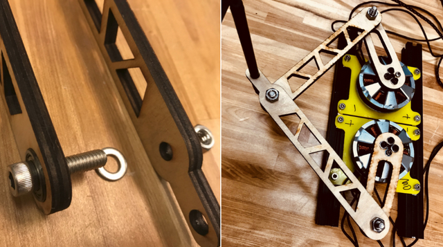

# Overview

For the first half of the class student teams will be working with a single leg kit. This consistes of two motors and encoders, leg components, and a motor driver with power supply. The following instructions will lead you through the assembly and setup of your leg kit. 

__Disclaimer: While we are using low-voltages (24V) it is still important to follow safe laboratory practices. Always work with your partner in the lab and each power supply must be connected to the provided surge protector with on/off switch.__ 

# Assembly instructions

Follow all instructions carefully! The general order of operations should be: 1) encoder and motor mounting (but no legs), 2) configuring your programming environment and flashing the ODrive (follow all ODrive instructions carefully!), 3) Testing the ODrive through ```explore_odrive.py```, 4) Connect the legs.


## Item list (each group): 
1. BLDC motors 335KV x2 (with M3x10mm bolts x8)

2. Laser cut legs and spacers x5

3. 21A~24V DC power supply x1

4. AMT 102 CUI encoder x2 (with 4 flat head M3 bolts)

5. ODrive x1 BLDC driver

6. M4 bolts x8 and nuts x8

7. Jumper wires  (>=11)

8. 8020 T-slot aluminum frame x2

9. allen wrench M2.5 x1

10. allen wrench M3 x1

11. 15ft power coord (will be chopped into three pieces for the power supply and motor cables)

12. Surge protector

13. r4z (1/4''-5/8'') bearings x3

14. Clamp

15. (1/4-20) bolts & nuts & washers x3 pairs

## Mechanical setup (phase 1)

1. Encoder connection: using 2 M3 bolts to connect the encoder on the back of the shaft of the DC motor.


2. Fasten the motor on to the acrylic mounts then fasten the whole thing onto the 8020s, adjust the distance of the 2 motors as you want. 


## Electrical connections:

1. The power supply is connected to the wall using the provided 3-wire cord. Cut the 3-wire coord (__while unplugged!__) approximately 2 feet from the plug end. Strip the wires and connect the color codes to the power supply terminals (see the table below). Use two 12 gauge wires to connect the power supply to the ODrive. 

_Note_: (on the power supply)  

| Power supply terminal | Connected to |
|-----------|:--------|
| G (the ground symbol) | Green wire | 
| N | Black wire | 
| L | White wire | 
| +V | +V (ODrive) |
| -V | -V (ODrive) |
                                 

2. Motors (3 wires on each) connected to both M0 and M1 port. There are three wires coming out of the motor, the middle wire must be connected to the middle terminal on the ODriver but the 1st and 3rd wires can be connected to either ODrive end.

3. Encoder must to be connected correctly using 4 jumper wires, __or the encoder will be burned!!__
  
  | Encoder   | ODrive   |
  |-----------|:--------|
  | GND       | GND|
  | 5V        | 5V|
  | Channel A |  A|
  | Channel B | B|
  
4. Programmer connection is quite the same as the encoder, __GND has to be connected first!!__ [Ctrl+F --> "SWC" on this page](https://github.com/madcowswe/ODrive/blob/master/Firmware/README.md)
  
  | Programmer  | ODrive   |
  |-----------|:--------|
  | GND       | GND|
  | SWCLK        | SWC|
  | SWDIO |   SWD|
  
  
5. Solder two lead wires to the shunt resistor and attach it to the ODrive board (__AUX__)


The Electrical connections should look like the image above. In (1) we show the power supply connections (__make sure to replace the cover and the plastic terminal covers before using!__). In (2) we show the motor & encoder connections to the ODrive and the power resistor. (3) Shows the encoders. (4) Shows the location of the programmer connections. 

Now we finished all the electronic connection parts  (o_o)!

## Software configuration:

1. Download Python 3 and Jupyter Lab as mentioned in class. (__Windows 10/8/7 can use Anaconda, install python and jupyter lab from there__) [Anaconda Downloads](https://www.anaconda.com/download/#linux)

2. Download VSCode for firmware flashing [VSCode](https://code.visualstudio.com/). This will be used to program the ODrive firmware.

3. Download the whole zip folder on the website and follow the steps in setting up the firmware [ODrive github firmware](https://github.com/madcowswe/ODrive/blob/master/Firmware/README.md)

## Testing communication and control of the motors without the legs

1. Following the [instructions](https://github.com/madcowswe/ODrive/blob/master/Firmware/README.md) on the ODrive website setup the firmware. 

    a. Change the motor poles to 7.
    
    b. Verify the encoder CPR is 2048*4.
    
    c. Connect the programmer and build and flash the firmware.

2. Open up a terminal and navigate to the folder with the ```explore_odrive.py``` file. 

3. Run the command ```python explore_odrive.py``` which drops you in an interactive shell. 

4. Try and test the encoder. Run the command ``` print(my_drive.motor0.encoder.pll_pos,my_drive.motor0.encoder.pll_pos)```. (rotate the motor shaft and run this command again and you'll see the change.)

5. Lastly move the motor a short distance. Run the command ``` my_drive.motor0.set_pos_setpoint (a1,a2,a3)```. (a1--position setpoint, a2--feedforward velocity, a3--feedforward current). The same with motor1 ``` my_drive.motor1.set_pos_setpoint (a1,a2,a3)```

## Attach legs

3.Put on the legs onto the motors using props(in the motor box), bolts and nuts (1/4''-20) and run the example code as provided from the ODrive folder you downloaded. 

Using the legs as a manipulator to draw your name (a pen should be inserted)





TA Office Hour:

Room 311
Mon. 4-5:30pm
Thu. 2-3:30pm

```python

```
